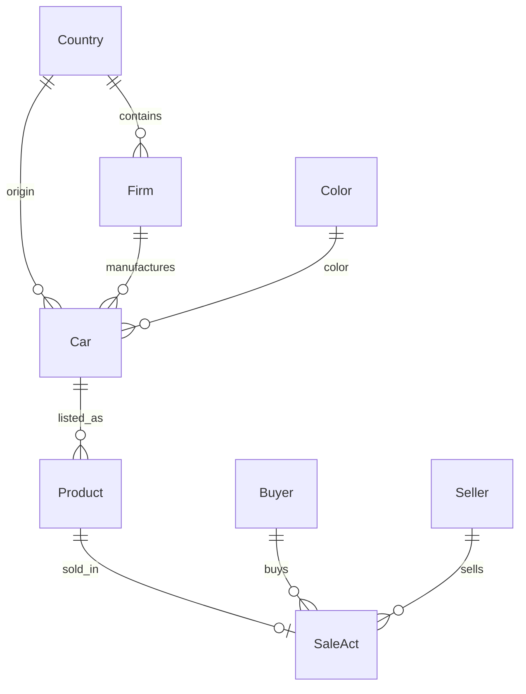

# Car Dealership

A Django + PostgreSQL web application for managing a car dealership domain: cars, manufacturers, inventory, buyers, sellers, and sales.

The project focuses on relational data modeling, reusable class-based views, server-side filtering/search, domain validation, and a simple local development setup.

## Features

- CRUD for countries, colors, manufacturers, cars, products, buyers, sellers, and sale acts;
- search across entity lists;
- filters for related entities and inventory state;
- pagination for list views;
- navigation through relational data;
- domain-level validation for prices, dimensions, engine power, colors, and sales;
- PostgreSQL-backed persistence;
- reusable generic views and templates for common CRUD operations;
- environment-based configuration;
- Docker Compose setup for the local PostgreSQL database;
- strict static type checking with `mypy` and `django-stubs`;
- code quality checks with `ruff`.

## Tech Stack

- **Python 3.14+**
- **Django**
- **PostgreSQL**
- **psycopg**
- **uv**
- **Docker Compose**
- **mypy + django-stubs**
- **Ruff**

## Domain Model



Main entities:

- `Country` — country reference data;
- `Color` — car color with a validated HEX value;
- `Firm` — manufacturer linked to a country;
- `Car` — vehicle model with manufacturer, country, color, dimensions, engine power, and release year;
- `Product` — dealership inventory item with a price;
- `Buyer` and `Seller` — participants in a sale;
- `SaleAct` — completed sale linking a product, buyer, seller, and timestamp.

Application-level validation prevents the same product from being sold more than once.

## Architecture

The application uses Django class-based views and a small set of reusable abstractions instead of duplicating CRUD logic for every entity.

`BaseEntityListView` provides common list-page behavior such as pagination, search handling, table metadata, and value formatting. `BaseEntityDetailView` does the same for detail pages, while shared create/update/delete views provide common form behavior.

Entity-specific views extend these abstractions and add their own queryset optimizations and filters. Related objects are loaded with `select_related()` where appropriate to avoid unnecessary database queries.

The project uses server-rendered Django templates and PostgreSQL as the primary database.

## Search and Filtering

Examples of supported filtering:

- manufacturers by country;
- cars by manufacturer and color;
- products by sold / available status;
- sale acts by seller;
- text search for names and car models.

## Validation

The domain model contains validation rules such as:

- HEX colors must use the `#RRGGBB` format;
- car engine power, length, and width must be positive;
- product price must be positive;
- one product cannot be referenced by multiple sale acts.

## Local Development

### 1. Clone the repository

```bash
git clone https://github.com/LEv145/car-dealership.git
cd car-dealership
```

### 2. Create the environment file

Copy `.env.example` to `.env`:

```bash
cp .env.example .env
```

On Windows PowerShell:

```powershell
Copy-Item .env.example .env
```

Default development values are already compatible with the included PostgreSQL Docker Compose configuration.

### 3. Start PostgreSQL

```bash
docker compose -f database/docker-compose.yml up -d
```

### 4. Install dependencies

```bash
uv sync
```

### 5. Apply migrations

```bash
uv run python manage.py migrate
```

### 6. Run the application

```bash
uv run python manage.py runserver
```

Open <http://127.0.0.1:8000/>.

## Development

Run static type checking:

```bash
uv run mypy .
```

Run Ruff:

```bash
uv run ruff check .
```

## Project Structure

```text
car-dealership/
├── config/             # Django project configuration
├── dealership/         # Domain models, forms, views and URL routes
├── database/           # Local PostgreSQL Docker Compose setup
├── templates/          # Server-rendered templates
├── .env.example        # Development environment template
├── manage.py
└── pyproject.toml
```

## Project Context

This project was developed as a university software-engineering project around an existing car-dealership database domain. The implementation emphasizes clean relational modeling, reusable Django abstractions, validation, search/filtering, and practical PostgreSQL integration rather than presenting a production-ready commercial system.
